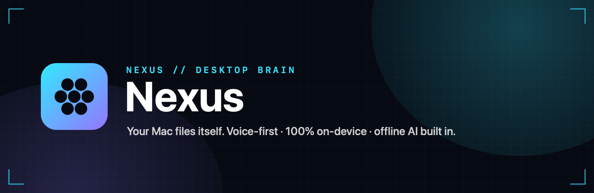
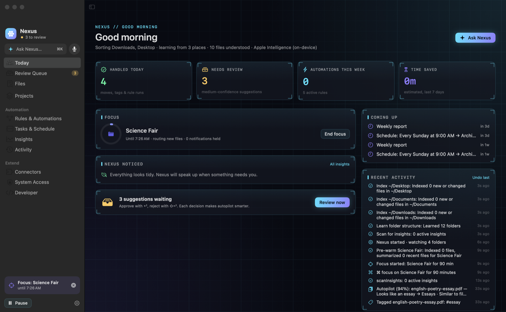
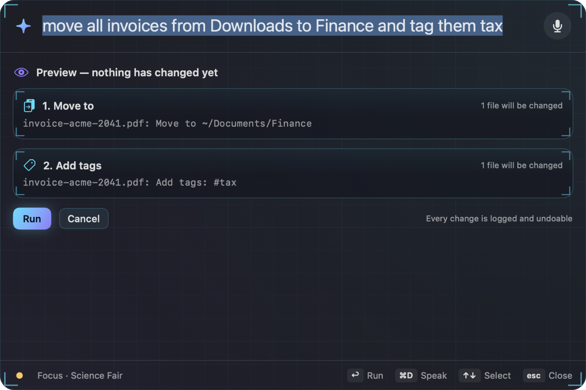
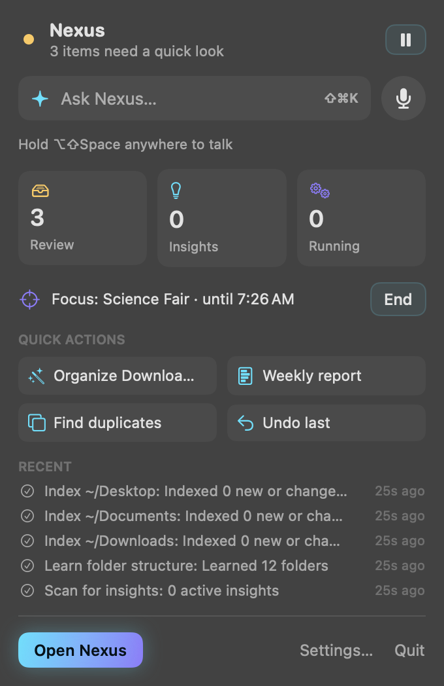
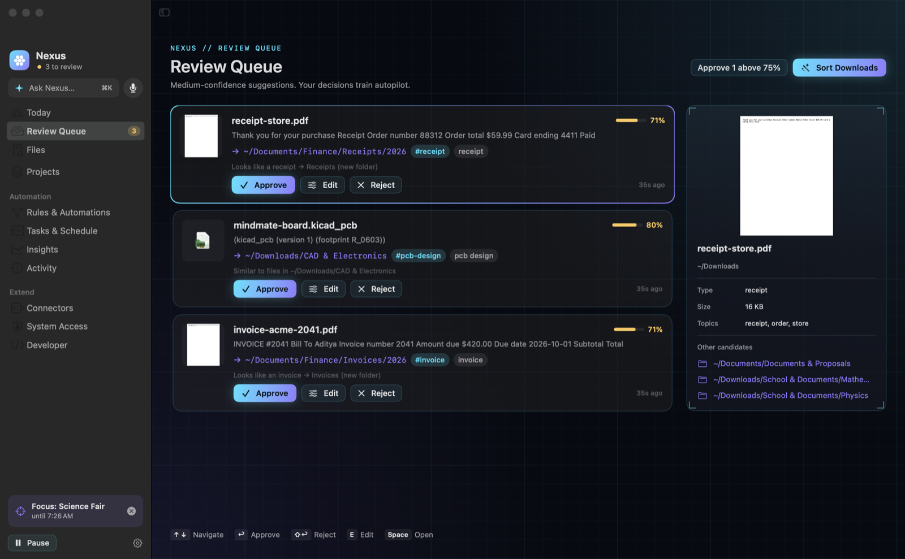
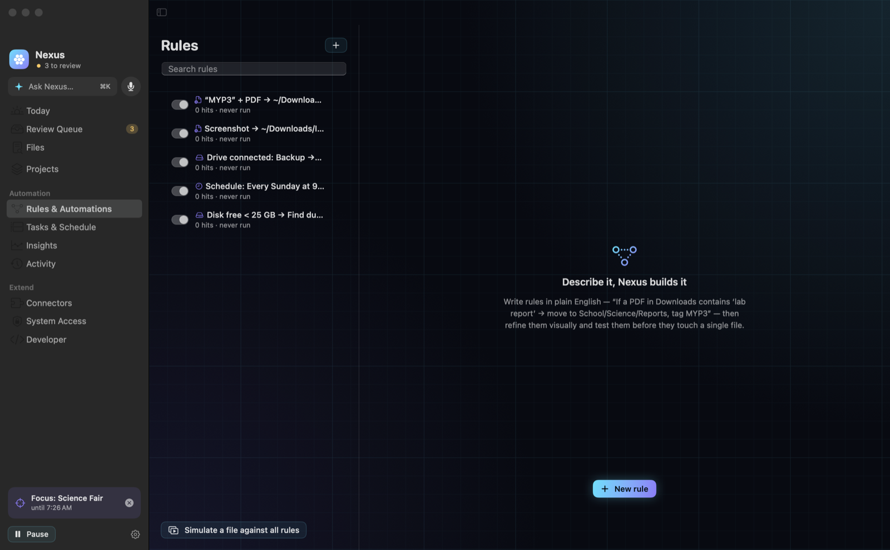
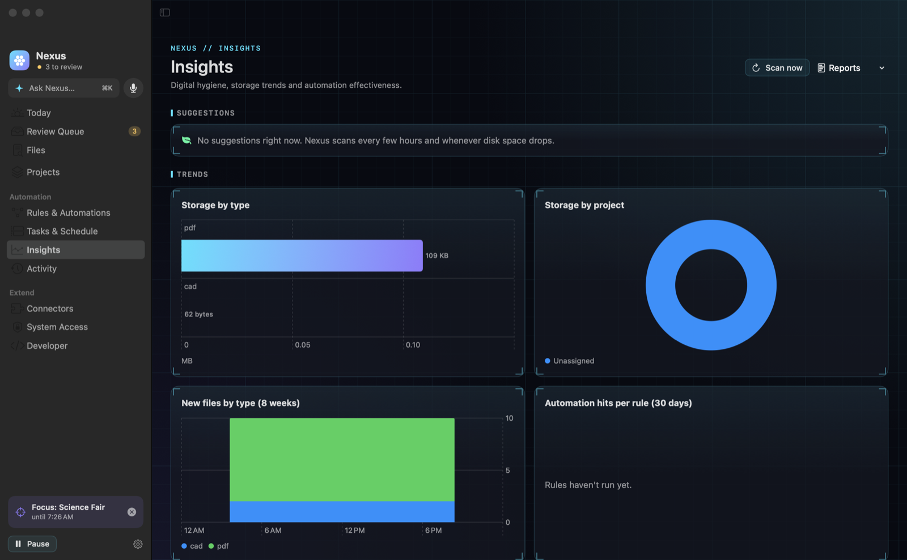

<p align="center">
  
</p>

<p align="center">
  <a href="https://github.com/AdityaJainDXB/Nexus/releases/latest/download/Nexus-1.0.0.dmg"></a>
  &nbsp;
  <a href="https://github.com/AdityaJainDXB/Nexus/releases/latest"></a>
</p>

<p align="center">
  
  
  
  
  
</p>

<p align="center"><b>Nexus is an always-on agent that lives in your menu bar. It reads what's <i>inside</i> your files, learns how <i>you</i> organize, files new downloads into your existing folders, cleans up clutter, runs your automations, and does all of it from a sentence — typed or spoken. Nothing leaves your Mac.</b></p>

---

## Why Nexus

| Siri / Spotlight | **Nexus** |
|---|---|
| Finds files by name | Understands content — invoices, lab reports, syllabi, KiCad boards, screenshots (OCR) |
| Can't act on your files | Moves, renames, tags, dedupes, archives, syncs — with a preview and **one-click undo** |
| Doesn't know your folders | Learns *your* structure (`School & Documents/Physics`, `CAD & Electronics`, iCloud) and files into it |
| No automation | Rules in plain English: *“If a PDF in Downloads contains ‘MYP3’ → move to School, tag myp3”* |
| Answers the web | Answers **your files**: *“When is the BrightSparks invoice due?”* → *“Nov 5, $84 [1]”* |
| Needs the cloud | Bundled offline model (llama.cpp + Qwen 2.5), Vision OCR, on-device speech |

## A look inside

<p align="center">
  
</p>

<table>
  <tr>
    <td width="60%"></td>
    <td width="40%"></td>
  </tr>
  <tr>
    <td><b>Command palette</b> — type or <i>say</i> what you want. Nexus shows exactly what will change before anything happens.</td>
    <td><b>Menu bar</b> — status, review queue, insights and quick actions one click away.</td>
  </tr>
</table>

<p align="center"></p>
<p align="center"><sub><b>Review Queue</b> — medium-confidence suggestions routed to your real folders. Approve with ↩, reject with ⇧↩; every decision teaches autopilot.</sub></p>

<p align="center"></p>
<p align="center"><sub><b>Desktop hotbar</b> — a slim HUD with a live activity ticker, push-to-talk mic and quick actions.</sub></p>

<table>
  <tr>
    <td></td>
    <td></td>
  </tr>
  <tr>
    <td align="center"><sub>Rules in English + visual flow builder + simulator</sub></td>
    <td align="center"><sub>Insights with one-click fixes</sub></td>
  </tr>
</table>

## Features

**🧠 Understands your files** — PDFs (incl. scanned, via OCR), Word/Pages, spreadsheets, slides, code, images, CAD/PCB files. Extracts document type, topics, people, dates, courses and amounts. Full-text + semantic search and a knowledge graph of related files.

**📁 Files things where *you* would** — discovers your Documents, Desktop, organized Downloads subfolders, iCloud Drive and OneDrive, then routes new files into them. High confidence → done automatically. Medium → Review Queue. Low → left alone.

**🎙 Voice-first** — hold **⌥⇧Space** anywhere, talk, release. Nexus reads risky plans back (*“Move 7 files… run it?”*) and speaks results. Recognition runs on-device.

**⚡ Automations in plain English** — 17 triggers (new download, app opened, drive connected, disk low, schedules, GitHub/Mail/Notion events…), 31 actions, a visual node builder, a simulator and conflict detection.

**🧹 Digital hygiene** — removes re-downloaded duplicates automatically, cleans duplicate sets and near-identical screenshots in one command, flags stale downloads and inactive projects.

**💬 Ask your files** — *“What did my hydroponics lab conclude?”* answered from your documents with sources, fully offline.

**🎯 Projects & Focus** — projects with deadlines and keywords; focus mode routes new files into the active project and holds non-urgent notifications. Meeting prep gathers related files before calendar events.

**📱 iPhone remote** — pair your iPhone with a 6-digit code and command your Mac from anywhere on your network: speak commands, approve the review queue, apply fixes. End-to-end encrypted (ChaCha20-Poly1305), replay-protected.

**🧩 Widgets** — status, insights and a one-tap “Talk to Nexus” widget for your desktop and Notification Center.

**🛡 Built to be trusted** — every change is journaled and undoable, deletes go to the Trash, a runaway guard pauses automations if something goes wrong, system and `~/Library` locations are protected, scripts run sandboxed, secrets stay in the Keychain.

## Install

### Mac
1. Download **[Nexus-1.0.0.dmg](https://github.com/AdityaJainDXB/Nexus/releases/latest/download/Nexus-1.0.0.dmg)** (≈1 GB — it includes the offline AI model).
2. Open it and drag **Nexus** into **Applications**.
3. First launch: Nexus is not yet notarized by Apple, so macOS will warn you.
   Open **System Settings → Privacy & Security**, scroll down and click **Open Anyway** next to Nexus. You only do this once.
4. Follow the short setup: confirm the folders Nexus found, grant access, pick starter automations.

> Tip: for whole-Mac organizing, grant **Full Disk Access** from the **System Access** page inside Nexus.

### iPhone (optional)
The companion app isn't on the App Store yet. Download **`NexusRemote-1.0.0.ipa`** from the [latest release](https://github.com/AdityaJainDXB/Nexus/releases/latest) and install it with **[AltStore](https://altstore.io)** or **[Sideloadly](https://sideloadly.io)** using your Apple ID. Then on your Mac: **Nexus → Connectors → Allow iPhone control → Pair iPhone**, and enter the code on your phone. If macOS asks whether Nexus may accept incoming connections, click **Allow**.

## Keyboard & voice

| Shortcut | Action |
|---|---|
| **⌥⇧Space** (hold / tap) | Talk to Nexus from any app |
| **⇧⌘K** | Command palette from anywhere |
| ↩ · ⌘↩ · ↑↓ · ⌘1–6 · ⌘Z · ⌘R · esc | Palette: go · confirm · select · quick actions · undo · reveal · close |
| ⌘1–9 · ⌘N · ⇧⌘N · ⇧⌘F | Sections · new rule · new project · search files |
| ⌥⌘Z · ⌥⌘O · ⌥⌘P | Undo automation · organize Downloads · pause |
| ⌘/ | Full cheat sheet |

## Things to try

```text
organize Downloads
clean up duplicates
find everything about hydroponics from this month
move all invoices from Downloads to Finance and tag them tax
When external drive 'Backup' is connected → sync Documents to /Volumes/Backup
every Sunday at 9am generate weekly report
focus on Science Fair for 90 minutes
file this            (with files selected in Finder)
brief me
```

## Privacy

Everything — reading documents, OCR, embeddings, the language model, speech — runs on your Mac. Nexus only talks to the network for connectors you explicitly enable (GitHub, Slack, Notion, webhooks) and for the iPhone remote on your local network.

## For developers

<details>
<summary>Build from source, architecture, tests</summary>

Requirements: macOS 14+ with Xcode 16+ (Swift 6 toolchain), Apple Silicon.

```bash
./scripts/build-app.sh        # fetches llama.cpp + model, builds Nexus.app with widgets & CLI
./scripts/make-dmg.sh         # styled DMG in dist/
./scripts/check-all.sh        # unit tests, all builds (Mac + iOS), smoke tests, DMG checks
./scripts/e2e.sh              # 30 end-to-end scenarios against the installed /Applications/Nexus.app (sandboxed home)
open iOS/NexusRemote.xcodeproj
```

- [Architecture](docs/ARCHITECTURE.md) · [Data model](docs/DATA_MODEL.md) · [Natural language → rules](docs/NL_RULES.md)
- [UI wireframes](docs/UI_WIREFRAMES.md) · [Features & roadmap](docs/FEATURES_AND_USP.md) · [MVP scope](docs/MVP.md) · [Code tour](docs/CODE_SKELETONS.md)
- Local REST API on `127.0.0.1:7788` and the `nexusctl` CLI (`Nexus.app/Contents/MacOS/nexusctl`).

```
Sources/NexusCore/   agent core — intelligence, rules, scheduler, insights, connectors, API, remote
Sources/Nexus/       SwiftUI app — palette, voice, hotbar, views
Widgets/             WidgetKit extension
iOS/                 Nexus Remote (iPhone)
Sources/nexusctl/    CLI
```
</details>

## Credits

Built with SwiftUI, Vision, NaturalLanguage, Speech and WidgetKit. Offline AI by [llama.cpp](https://github.com/ggml-org/llama.cpp) (MIT) running [Qwen2.5-1.5B-Instruct](https://huggingface.co/Qwen/Qwen2.5-1.5B-Instruct-GGUF) (Apache 2.0).

<p align="center"><sub>MIT License · Made for people whose Downloads folder is a crime scene.</sub></p>
