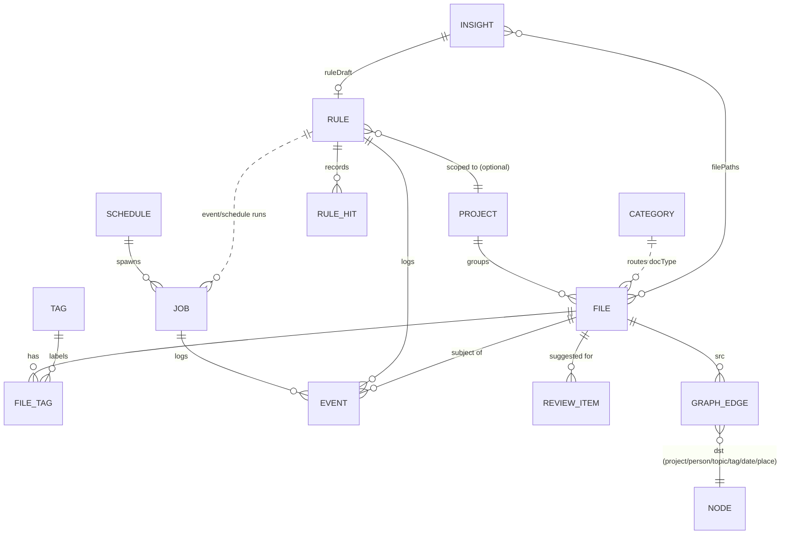

# Nexus — Data Model

Storage is one SQLite database (`~/Library/Application Support/Nexus/nexus.sqlite`, WAL mode). Each entity is a
Codable Swift struct (`Sources/NexusCore/Models/*.swift`), stored as a JSON document next to the indexed columns used
for querying. This keeps migrations cheap while queries stay fast.

## Entities

### File (`FileRecord`) — table `files`, plus `files_fts`, `file_tags`, `embeddings`
| Field | Type | Notes |
|---|---|---|
| id | UUID | stable across moves and renames |
| path | string, unique | canonical path |
| kind | enum | pdf, document, spreadsheet, presentation, text, code, image, screenshot, audio, video, archive, installer, folder, other |
| size, createdAt, modifiedAt, indexedAt | | |
| contentHash | SHA-256 | exact duplicates |
| perceptualHash | UInt64 dHash | near-identical images |
| docType, confidence | string, 0–1 | invoice, lab report, syllabus, spec… |
| language | string | natural or code language |
| topics | [string] | noun lemmas and taxonomy terms |
| entities | [Entity(kind, value)] | person, organization, place, date, course, money, url, email |
| snippet, summary | string | the summary is produced on-device |
| tags | [string] | mirrored to Finder tags |
| projectId, category | FK, string | |
| status | enum | indexed · review · filed · ignored · missing |
| sourceURL | string | download origin |

The full text lives in FTS5 (`name, content, topics, tags, entities`, porter stemming). Sentence vectors
(`NLEmbedding`, Float32 BLOB) are stored in `embeddings`.

### Tag — `tags(name PK, color, created)`, join table `file_tags(file_id, tag)`

### Category — `categories`
`name, destination (template path), keywords[], docTypes[], learned`. These are the built-in taxonomy that
autopilot routes to (review-gated until you confirm a few).

### Project — `projects`
`name, color, icon, folders[], keywords[], tags[], deadline?, notes, links[ProjectLink], archived, createdAt, lastActivityAt`

### Rule — `rules` (+ `rule_hits(rule_id, ts)` for charts and time-saved)
| Field | Notes |
|---|---|
| trigger | `Trigger{kind, folders[], recursive, cron?, appName?, volumeName?, threshold?, connectorEvent?}`. 17 kinds: fileAdded, fileModified, downloadCompleted, schedule, manual, appLaunched/Quit, volumeMounted/Unmounted, diskSpaceBelow, folderCountAbove, folderSizeAbove, idle, wake, focusStarted/Ended, connectorEvent |
| conditions | `ConditionGroup{match: all/any, conditions[Condition{field, op, value}]}`. Fields: name, ext, kind, content, anyText, sizeMB, ageDays, folder, docType, language, tag, project, topic, entity, sourceURL, hour, weekday. Ops: contains, notContains, equals, notEquals, startsWith, endsWith, matches (regex), >, <, isAnyOf, exists. `a\|b` means either. |
| actions | `[RuleAction{kind, target, tags[], project?, params{}}]` with 31 kinds (file ops, tags/projects, notifications, reminders/calendar, AI summary, shell/AppleScript/Shortcut/plugin, webhook, sync/archive/sort/duplicates/report, GitHub/Obsidian/Slack/Notion). Targets support `{name} {basename} {ext} {year} {month} {day} {date} {project} {docType} {language} {topic}` plus connector payload keys such as `{title}`. |
| priority, stopProcessing, requireConfirmation, cooldownMinutes | execution semantics |
| naturalLanguage | the sentence it was built from |
| hitCount, lastTriggeredAt, estimatedSecondsSaved | effectiveness |
| layout | node positions for the visual builder |
| projectId | project-aware rules |

### Task (`Job`) — `jobs`
`name, kind (file/ai/script/integration/system), status (scheduled/queued/running/completed/failed/cancelled),
priority (low/normal/high/focus), spec: JobSpec{operation, path, paths, ruleId, actions, command, params},
scheduleId, createdAt, scheduledFor, startedAt, finishedAt, attempts, maxAttempts, log[], resultSummary, error`

### Schedule — `schedules`
`name, mode (once/recurring/conditional), runAt?, cron?, conditions[SystemCondition{kind, folder?, number}],
jobKind, job: JobSpec, priority, enabled, cooldownMinutes, lastRunAt, nextRunAt, naturalLanguage`

### EventLog (`ActivityEvent`) — `events`
`timestamp, kind (fileMoved, ruleFired, jobFailed, undo, guardTripped, …), message, fileId, ruleId, jobId, batchId,
undo: UndoRecord{op, from, to, tags, fileId, previousProjectId}?, undone`. This is the audit trail and the undo
journal in one table; a `batchId` groups one command or rule run so it can be undone as a unit.

### Insight — `insights`
`key (dedupe), kind (staleDownloads, duplicates, similarScreenshots, folderGrowth, inactiveProject, lowDisk,
patternRule, projectAssociation, largeFiles, reviewBacklog, ruleConflict, deadlineSoon), title, detail, severity,
command? (one-click fix), ruleDraft?, filePaths[], metric, dismissed`

### ReviewItem — `review_items`
`fileId, path, suggestedDestination, suggestedTags, suggestedProjectId, suggestedCategory, confidence, reasons[],
alternatives[], ruleId?, status (pending/approved/rejected), createdAt, resolvedAt`

### Knowledge graph — `graph_edges(src_type, src_id, dst_type, dst_id, relation, weight)`
Edges: file→topic (`about`), file→person/organization/place/date (`mentions`), file→tag (`taggedWith`),
file→project (`belongsTo`). "Related files" are 2-hop neighbours weighted by node type.

### Supporting tables
`observed_moves` (manual moves, for pattern detection), `folder_snapshots` (daily size and count for growth charts),
`command_history`, `kv` (settings JSON, taxonomy memory, focus session, schedule cursors).
